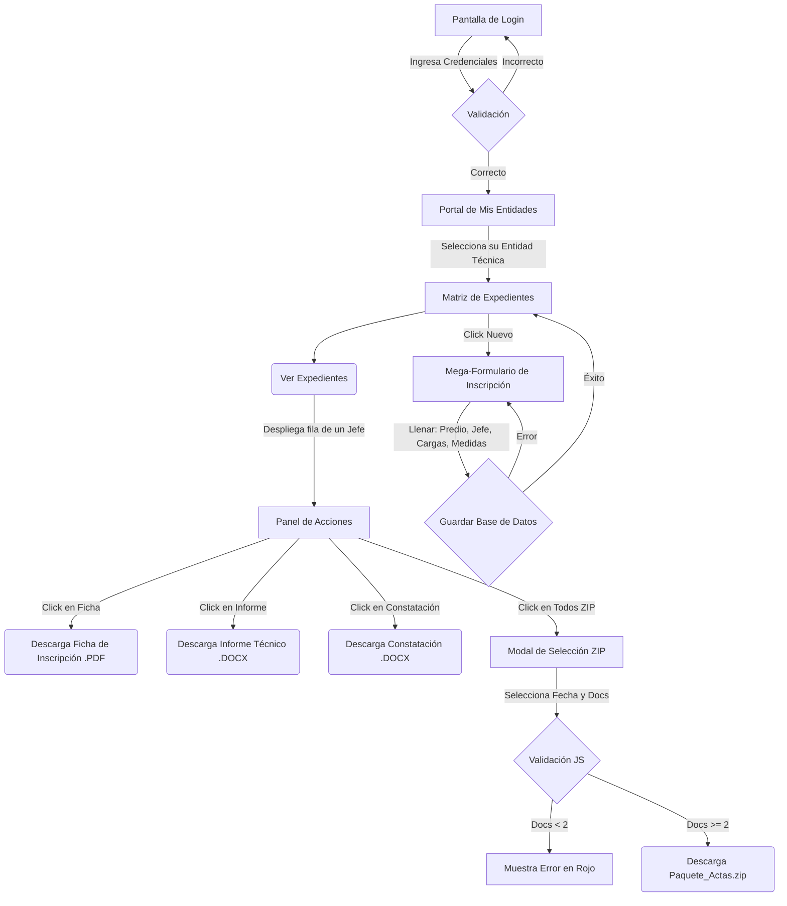

# Flujo de la Aplicación (User Flow)
## Gestor de Expedientes (Techo Propio)

Este documento detalla la ruta que sigue un usuario (Entidad Técnica) al interactuar con el sistema, paso a paso, abarcando desde que abre la plataforma hasta que extrae los documentos oficiales de un cliente.

---

### Diagrama de Flujo Principal (Mermaid)

---

### Paso a Paso del Flujo de Usuario

#### 1. Autenticación (Login)
- El usuario normal accede a `/login_usuario` (o a la raíz `/` que redirige allí si no tiene sesión activa).
- Se enfrentará a un formulario pidiendo `Usuario` y `Contraseña`.
- Si las credenciales son incorrectas, salta un mensaje de "Usuario o clave incorrectos" y permanece en la página.
- Si las credenciales son válidas, se le crea una `session` segura y es redirigido a su portal.

#### 2. Portal de Entidades
- Al entrar en `/portal_entidades`, el usuario ve una lista de tarjetas grandes (`cards`) que representan las **Entidades Técnicas** que tiene asignadas.
- Hace click en su empresa (ej. `Coquitos` o `Senia`).
- Esto lo traslada a la página central de gestión: `/portal/matriz/<id_entidad>`.

#### 3. Matriz Principal (Gestión de Fichas)
Aquí el usuario ve la base de datos de todos los clientes (Jefes de Familia) que ya registró previamente a nombre de esa entidad.
- Si la tabla está vacía, se muestra un ícono amigable y el mensaje *"No hay expedientes (fichas) registrados"*.

**Si quiere Registrar un Nuevo Expediente:**
1. Da clic en el botón superior derecho **"+ Nuevo Expediente"**.
2. Se le redirige al "Mega-Formulario" (`formulario_fichas_portal.html`).
3. El formulario está inteligentemente dividido en Acordeones para no agobiarlo:
   - **Predio** (Departamento, Provincia, Distrito, Lote, Partida, etc.)
   - **Jefe de Familia** (Nombres, DNI, Estado Civil)
   - **Cónyuge** (Sección Opcional)
   - **Cargas Familiares y Adicionales** (Opcional, hasta 3 hijos y 1 adicional)
   - **Constatación y Medidas** (Linderos: Frente, Derecha, Fondo, Izquierda y Servicios Básicos).
4. El usuario da clic en **"Guardar Expediente"** al final de la hoja.
5. El servidor recibe, crea los registros vinculados en la base de datos, asocia la ficha a la Entidad seleccionada y lo devuelve a la tabla principal con un recuadro verde de "Éxito".

#### 4. Motor de Descargas (Generación de Entregables)
Una vez creado el beneficiario, el usuario lo ve en la tabla. Para extraer los documentos, hace clic sobre la fila del beneficiario para desplegar hacia abajo las herramientas (Panel de Acciones).

Tiene 4 opciones principales:
1. **Ficha de Inscripción**: Llama al backend, que rellena una plantilla PDF (`FICHA DE INSCRIPCION.pdf`) en coordenadas exactas usando los datos del cliente, y baja al instante el archivo.
2. **Informe Técnico**: Llama al backend, que abre `INFORME_TECNICO_MASTER.docx`, reemplaza las llaves `{{ DNIBENEFICIARIO }}`, descarga el logo de la Entidad desde internet, lo estampa en el documento y baja el archivo en Word.
3. **Formato de Constatación**: Llama al backend, que hace el mismo proceso de plantillado pero sobre `FORMATO DE CONSTATACIÓN.docx`.
4. **Todos (ZIP)**: Se abre un Modal emergente oscuro.
   - El Modal le pide al usuario seleccionar la **Fecha de Emisión** de los documentos (que se estampará en los archivos).
   - Abajo tiene casillas de verificación para elegir qué documentos empaquetar.
   - Si intenta descargar seleccionando solo 1 (o ninguno), la validación JavaScript frena todo y le indica que **"Debe seleccionar al menos dos documentos"**.
   - Al marcar 2 o 3 opciones, el sistema genera los documentos seleccionados al vuelo en memoria RAM del servidor y le escupe un archivo `.zip` comprimido y listo para imprimir.

---

### 5. ¿Qué pasa si el Usuario comete un error? (Edge Cases)
- **Error:** Un campo importante (como el DNI del Jefe) no se guardó o se registró en blanco (Valor `Nulo`).
- **Flujo de Seguridad del Sistema:** Si el usuario presiona "Descargar Ficha", en lugar de que el servidor "explote", el sistema escanea todos los valores nulos, los convierte temporalmente en espacios en blanco (`""`) durante la generación del PDF y permite que la descarga proceda sin colapsar, para que el usuario luego pueda entrar a darle al botón **"Editar"** y corregir los datos.
